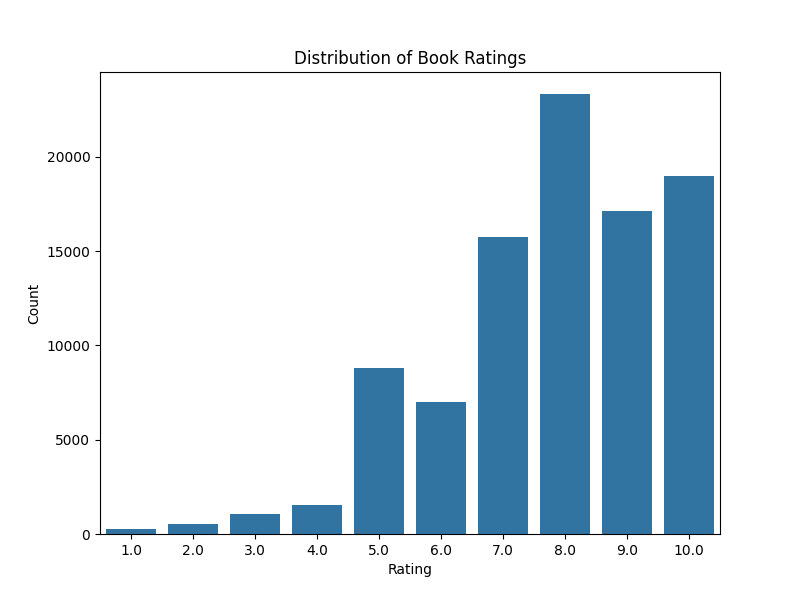
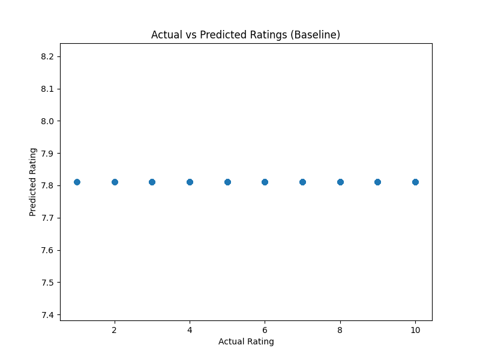

# Book Recommendation System

A collaborative filtering-based book recommendation system that suggests books to users based on their reading preferences and similarities with other users.

## Overview

This project implements a book recommendation system using collaborative filtering techniques. It analyzes user-book rating data to find patterns and recommend books that users might enjoy. The system includes both item-based and user-based collaborative filtering approaches, along with evaluation metrics and visualizations.

## Features

- **Item-Based Collaborative Filtering**: Finds books similar to a target book based on user rating patterns
- **User-Based Collaborative Filtering**: Identifies users with similar tastes and recommends books they liked
- **Data Preprocessing**: Handles missing values, filters sparse data, and prepares data for analysis
- **Evaluation Metrics**: Uses RMSE to evaluate recommendation accuracy
- **Visualizations**: Generates plots for rating distributions, top-rated books, and prediction accuracy
- **Comprehensive Analysis**: Includes statistical analysis of the dataset

## Data Source

The system uses the Book-Crossing dataset (BX-Book-Ratings.csv), which contains:
- User IDs
- ISBNs (book identifiers)
- Book ratings (1-10 scale, with 0 indicating implicit feedback)

Note: The dataset only includes ISBNs as book identifiers. Book titles, authors, and genres are not available in this dataset, which limits content-based filtering capabilities.

## Installation and Setup

### Prerequisites
- Python 3.7+
- Jupyter Notebook
- Required libraries: pandas, matplotlib, seaborn, scikit-learn

### Installation
1. Clone or download this repository
2. Install required packages:
   ```bash
   pip install pandas matplotlib seaborn scikit-learn jupyter
   ```

### Running the System
1. Open the `book_recommendation.ipynb` notebook in Jupyter:
   ```bash
   jupyter notebook book_recommendation.ipynb
   ```
2. Run all cells in sequence to execute the analysis

## Usage

### Basic Workflow
1. **Data Loading**: The system loads and preprocesses the book rating data
2. **Exploratory Analysis**: Generates visualizations of rating distributions and top-rated books
3. **Collaborative Filtering**: Computes similarities between books and users
4. **Recommendations**: Provides book recommendations based on user preferences
5. **Evaluation**: Assesses the accuracy of recommendations using RMSE

### Key Functions
- `get_similar_users(user_id)`: Finds users with similar rating patterns
- Item correlation analysis for book recommendations
- Train/test split evaluation

## Algorithms Explained

### Collaborative Filtering
Collaborative filtering makes recommendations based on the idea that users who agreed in the past will agree in the future.

#### Item-Based Filtering
- Analyzes the correlation between books based on user ratings
- For a target book, finds other books that received similar ratings from the same users
- Correlation coefficient measures similarity (closer to 1 = more similar)

#### User-Based Filtering
- Identifies users with similar rating patterns
- Recommends books that similar users have rated highly
- Useful for finding "taste twins" among users

### Evaluation
- **RMSE (Root Mean Square Error)**: Measures the difference between predicted and actual ratings
- Lower RMSE indicates better prediction accuracy
- Baseline model uses average rating for comparison

## Improvements Made

Compared to the original movie recommendation notebook, this enhanced version includes:

1. **Adapted for Books**: Modified to work with book rating data instead of movies
2. **Enhanced Preprocessing**:
   - Filters out implicit ratings (rating = 0)
   - Removes users with fewer than 5 ratings
   - Removes books with fewer than 10 ratings
3. **Dual Filtering Approaches**: Implements both item-based and user-based collaborative filtering
4. **Evaluation Framework**: Adds RMSE calculation and train/test split evaluation
5. **Visualizations**: Generates and saves plots for analysis
6. **Better Error Handling**: Improved data cleaning and missing value management

## Limitations

- **No Book Metadata**: Lacks book titles, authors, and genres, preventing content-based filtering
- **Cold Start Problem**: Cannot recommend books to new users or recommend new books effectively
- **Sparsity**: User-item rating matrix is sparse, which can affect recommendation quality
- **Scalability**: May require optimization for very large datasets

## Future Enhancements

- Integrate book metadata (titles, authors, genres) for content-based filtering
- Implement matrix factorization techniques (e.g., SVD)
- Add hybrid recommendation approaches
- Develop a web interface for user interaction
- Implement real-time recommendation updates

## Visualizations

### Rating Distribution


### Actual vs Predicted Ratings


### Top Rated Books


## Files Description

- `book_recommendation.ipynb`: Main Jupyter notebook with the recommendation system
- `BX-Book-Ratings.csv`: Book rating dataset
- `colaborative.ipynb`: Original movie recommendation notebook (for reference)
- `README.md`: This documentation file
- `TODO.md`: Development task list
- `rating_distribution.png`: Plot of rating distribution
- `actual_vs_predicted.png`: Plot comparing actual vs predicted ratings
- `top_rated_books.png`: Bar chart of top-rated books

